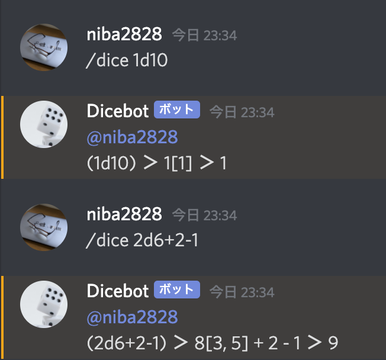

# dice_bot_discord
 
TRPGなどに欠かせないダイスロールをdiscordボットで実装しました。
 
## Demo
 

 
## Requirement

* python 3.8.5
 
## Installation
 
```bash
# Clone
git clone --recursive https://github.com/Futaba-Kosuke/dice_bot_discord
cd dice_bot_discord

# (optional) Build the virtual environment
python -m venv .env
source .env/bin/activate

# Install modules
python -m pip install -r requirements.txt
```
 
## Usage
 
```bash
# Start the server
python server.py
```
